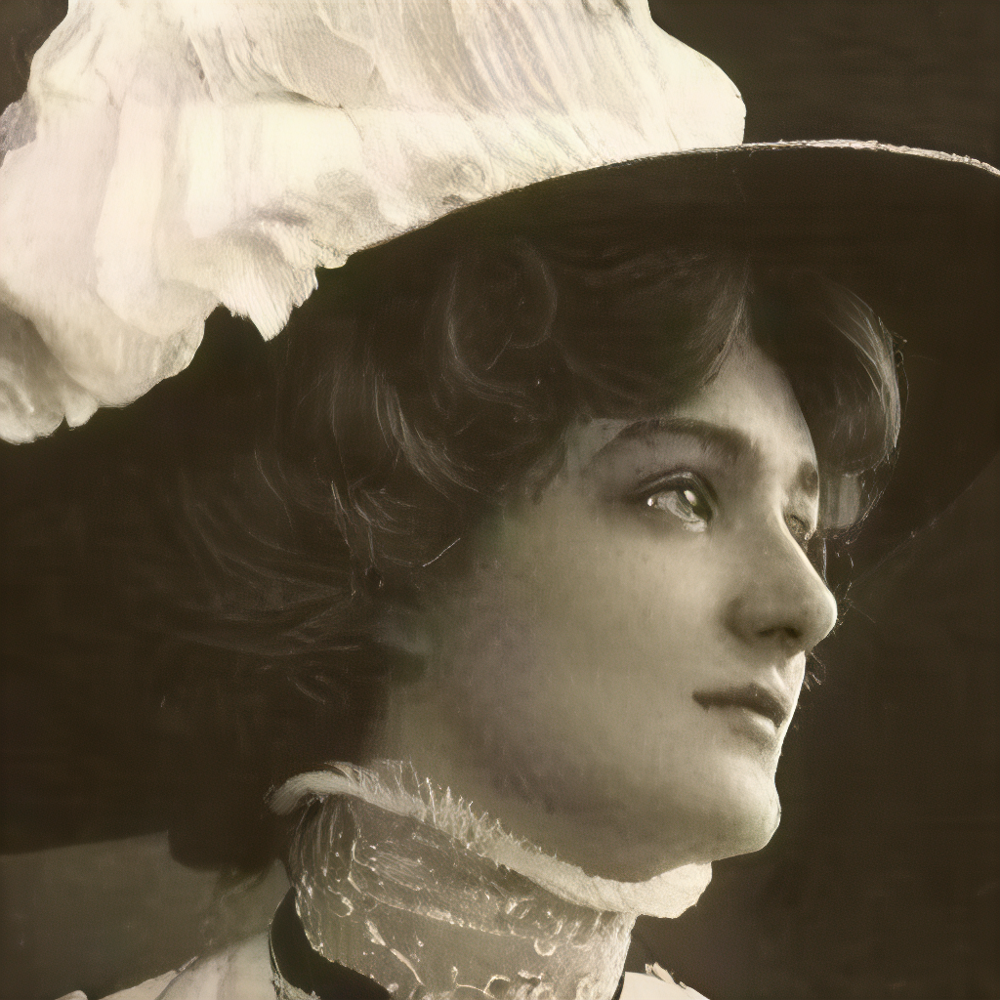
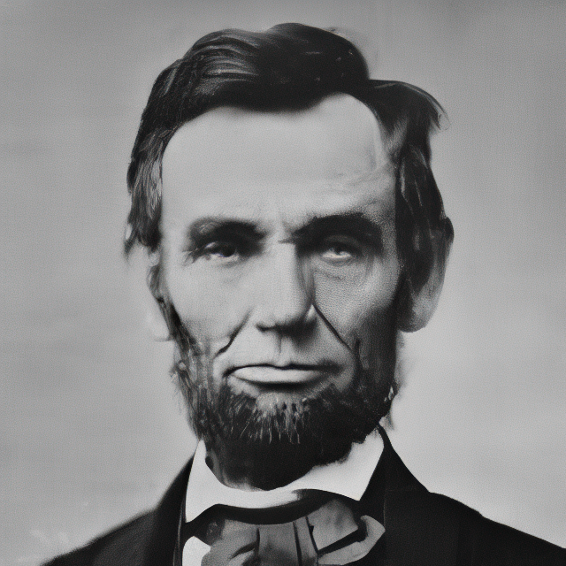
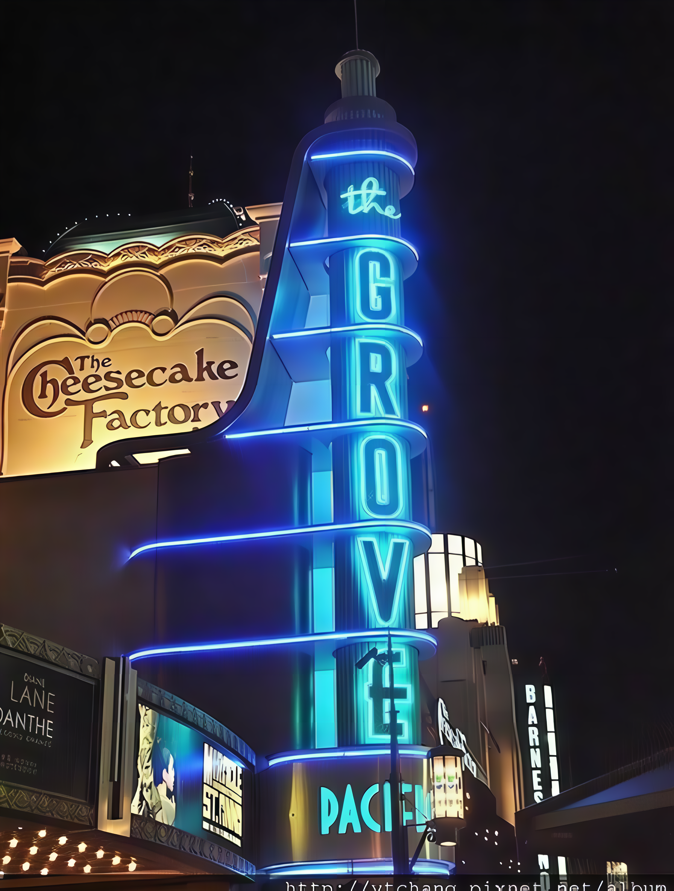

# LPNSR: Prior-Enhanced Diffusion Image Super-Resolution via LR-Guided Noise Prediction

A diffusion-based image super-resolution method that learns to predict optimal noise maps for efficient sampling.

---

> Diffusion-based image super-resolution (SR) suffers from a critical trade-off between inference effi-
ciency and reconstruction quality, especially in few-step sampling for practical deployment. While
the residual-shifting diffusion framework ResShift achieves efficient 4-step SR inference, it suffers
from severe performance degradation due to unconstrained random noise in intermediate steps and
naive initialization, leading to error accumulation and weak LR prior guidance. In this paper, we
propose LPNSR, a prior-enhanced efficient diffusion SR framework. We first design an LR-guided
multi-input-aware noise predictor to replace random Gaussian noise, embedding structural priors
into the reverse process while fully preserving the efficient residual-shifting mechanism. We fur-
ther optimize the diffusion initialization with a high-quality pre-upsampling network to mitigate
initial bias. With a compact 4-step trajectory, LPNSR can be optimized end-to-end. Extensive ex-
periments show that LPNSR achieves state-of-the-art perceptual performance on both synthetic and
real-world datasets without any text-to-image priors.

---

## Features

- **Efficient Sampling**: Only 4 sampling steps required for high-quality super-resolution
- **Noise Predictor**: Learn to predict optimal noise maps for partial diffusion initialization
- **Real-world SR**: Handles complex real-world degradations
- **SwinIR Integration**: Optional SwinIR refinement for enhanced details

## Visual Results

<div align="left">
  <b>4× Real-world Super-Resolution</b>
  <br><br>
  <table>
    <tr>
      <th>LQ Image</th>
      <th>SR Image</th>
    </tr>
    <tr>
      <td></td>
      <td></td>
    </tr>
    <tr>
      <td></td>
      <td></td>
    </tr>
    <tr>
      <td></td>
      <td></td>
    </tr>
  </table>
</div>

## Requirements

- Python 3.10.11, PyTorch 2.9.1+cu128, Xformers 0.0.33.post2
- A suitable conda environment named `lpnsr` can be created and activated with:

```bash
conda create -n lpnsr python=3.10.11
conda activate lpnsr

# Install PyTorch with CUDA support 
#CUDA 12.8
pip install torch==2.9.1 torchvision==0.24.1 --index-url https://download.pytorch.org/whl/cu128

# Install other dependencies
pip install -r requirements.txt

# Linux/headless environments: remove the GUI OpenCV wheel that may be
# installed transitively by basicsr/facexlib, then restore the headless wheel.
pip uninstall -y opencv-python
pip install --force-reinstall opencv-python-headless==4.12.0.88

# Install xformers for acceleration
pip install xformers==0.0.33.post2
```

## Pre-trained Models

Download all pre-trained models from [Hugging Face](https://huggingface.co/mirpri/LPNSR) or [腾讯微云](https://share.weiyun.com/2P35qGWJ) (password: `qdhijm`), and place them in the `pretrained/` folder:

| Model | Description |
|-------|-------------|
| `autoencoder_vq_f4.pth` | VQGAN encoder/decoder (4x spatial compression) |
| `resshift_realsrx4_s4_v3.pth` | Pre-trained ResShift UNet |
| `noise_predictor.pth` | Trained noise predictor |
| `003_realSR_BSRGAN_DFOWMFC_s64w8_SwinIR-L_x4_GAN.pth` | SwinIR for refinement |

## Quick Start

### :railway_car: Online Demo

Launch the Gradio demo:
```bash
python app.py
```
Then open `http://127.0.0.1:7860` in your browser.

### :rocket: Inference

```bash
python inference.py -i [image folder/image path] -o [output folder]
```

### :test_tube: Testing

```bash
python test.py --lq [lq image folder] --gt [gt image folder]
```

**Note:** If only LQ images are provided (without GT reference images), only no-reference metrics will be computed.

## Training

### :turtle: Preparing Stage

1. Create a folder named `traindata/` and put your training data in the `traindata/` folder (high-resolution images)
2. Download the pre-trained models (see above)
3. Adjust the configuration in `configs/train_noise_predictor.yaml`

### :dolphin: Begin Training

```bash
python train_noise_predictor.py --config configs/train_noise_predictor.yaml
```

### :whale: Resume from Interruption

```bash
python train_noise_predictor.py --config LPNSRconfigs/train_noise_predictor.yaml --resume experiments/noise_predictor/checkpoints/check_point_xx.pth
```

## Reproducing the results in our paper
### :red_car: Prepare data
Download datasets used in our paper from [Hugging Face](https://huggingface.co/datasets/mirpri/LPNSR) or [腾讯微云](https://share.weiyun.com/2P35qGWJ) (password: `qdhijm`), and place them in the `testdata/` folder

### :rocket: Begin Testing
```bash
python test.py --lq [lq image folder] --gt [gt image folder]
```

## Acknowledgement

This project is based on:
- [ResShift](https://github.com/zsyOAOA/ResShift) - Efficient diffusion model for image SR
- [BasicSR](https://github.com/XPixelGroup/BasicSR) - Basic super-resolution toolbox
- [SwinIR](https://github.com/JingyunLiang/SwinIR) - Swin Transformer for image super-resolution
- [Real-ESRGAN](https://github.com/xinntao/Real-ESRGAN) - Degradation simulation

## License

This project is licensed under the MIT License.

## Contact

If you have any questions, please feel free to open an issue or contact the maintainer via `frozen2001@qq.com`.
